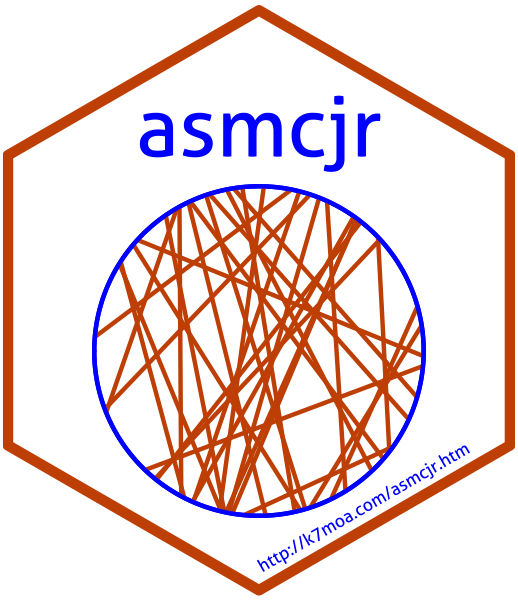

# asmcjr  <br /> 

[](https://travis-ci.com/yl17124/asmcjr)

[](https://codecov.io/gh/yl17124/asmcjr)


This package supports the book ["2nd Edition Analyzing Spatial Models of Choice and Judgment "](https://www.routledge.com/Analyzing-Spatial-Models-of-Choice-and-Judgment/II-Bakker-Carroll-Hare-Poole-Rosenthal/p/book/9781138715332).  In its second edition, much of the R code has been streamlined. This package contains all of the data and functions to replicate the analyses in the book. 

<br />
  
&nbsp;

## Installation
You will need lastest installation of [_R_](https://cran.r-project.org/mirrors.html) (preferably version 3.6 or above) and [RStudio](https://rstudio.com/products/rstudio/download/#download).  Visit [Installation](articles/installation.html) for further instructions.


```
install.packages("devtools", dependencies=TRUE)
library(devtools)
devtools::install_github("uniofessex/asmcjr")
```

## Support

<p align="center">
<iframe
  src="https://essexsummerschool.com"
  style="width:100%; height:350px;"
></iframe>

</p>


## Reference
For citation from this book, run `citation("asmcjr")`.  

